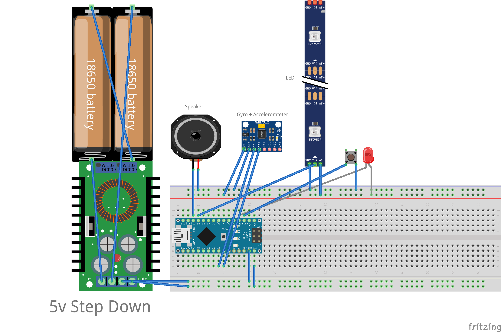

# Arduino Light Saber

## Specs:

- MPU 6050 – Accelerometer and GyroScope - 5V
- NeoPixel WS 2812 RGB Lights – 5V – individually addressable – 60 individual LEDs
- Speaker – 3W – Powered by PWM
- 2 x 18650 Batteries – 3200mAh, 3.7V

## Features

- Has 5 different base color modes, and a mode where
  LEDs changes based of angle, and rainbow.
- 2 Different sound modes
- Sweeping noises are made when the saber is swung
- Frequency Changes based on the angle of the saber.
- Flashes when an object is struck.
- Portable
- All controllable by one push button.

## Schematic

## Physical Materials

To house our whole design, we use a 1.5 in PVC tube. The hilt of the tube is removable so that we can replace batteries when needed and update the Arduino. The overall main electronics are compactly snugged into the PVC.

The saber pipe part where the RGB LEDs are stored is made from Methacrylate Polycarbonate, a semi-opaque material which is able to diffuse RGB LED Light.

## Description

Built for a final project for digital systems, wanted to create something flashy cool, and practical.s
